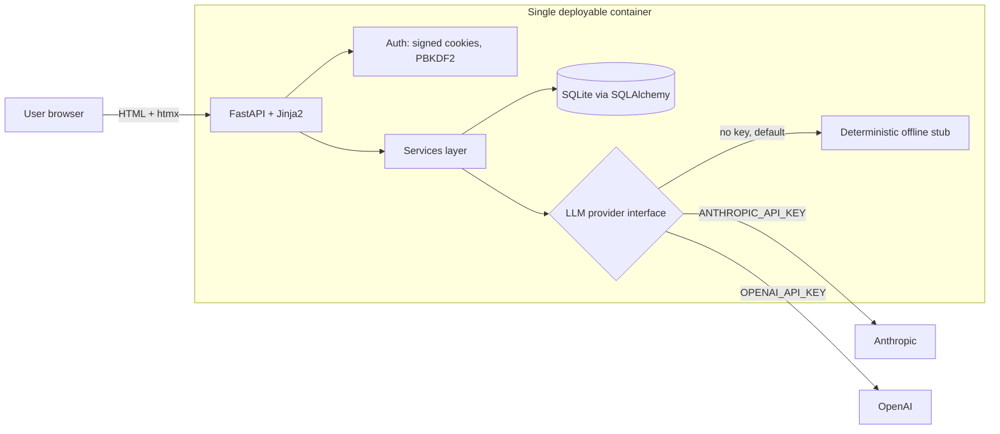

# InterviewCoach

Paste a job description, get role-specific interview questions, and receive instant rubric-based scoring with written feedback. It's a deploy-ready, full-stack AI product with a provider-agnostic LLM layer (Anthropic / OpenAI, or a deterministic stub for cost-free demos).

> **Live demo note:** the public demo runs the deterministic stub (instant, no keys), so questions and scores are reproducible; drop in an `ANTHROPIC_API_KEY` or `OPENAI_API_KEY` and the same code path switches to a live model, no changes.

## The problem

Generic interview prep doesn't map to the actual role you're applying for, and human mock interviews are slow and expensive to schedule. Candidates need targeted practice (questions drawn from the real job description, and honest, structured feedback on their answers) available on demand. InterviewCoach turns any job posting into a personalized interview loop with consistent, rubric-based scoring.

## What it does

- **Generates role-specific questions** from a pasted job description (technical + behavioural).
- **Scores each typed answer** on four weighted axes (relevance, specificity, structure, impact), each 1–5 with a written reason, plus an overall verdict and concrete strengths/improvements.
- **Saves a history dashboard** so a user can track average scores across sessions and see progress over time.
- **Runs anywhere instantly:** every LLM call sits behind a provider interface with a deterministic offline stub, so the full product works with no API key. Drop in `ANTHROPIC_API_KEY` or `OPENAI_API_KEY` to switch to a live model, with no code changes.



The question bank, scoring rubric, and aggregation live in small, dependency-free modules (`app/rubric.py`, `app/llm/stub.py`) so the grading logic is fully unit-testable without a network call.

## Results / impact

- **Zero-cost demo path:** runs end to end with **0 paid API keys**, since the offline stub returns deterministic questions and rubric scores. A one-click **`/demo`** route seeds and logs you into a scored sample session instantly.
- **34 automated tests**, green offline, covering scoring math, the provider stub, the services/seeding layer, auth/session security, and full request flows.
- **CI across Python 3.9 / 3.11 / 3.12** (lint + tests + an offline boot smoke test).
- **Single container, sub-second feedback:** answers are scored synchronously in one round-trip; the stub grades an answer in well under a millisecond locally.
- **Lean footprint:** 5 runtime dependencies; the production image is built on `python:3.12-slim` and runs as a non-root user with a `/health` check.
- **Weighted rubric** (impact 1.25×, structure 0.75×) so the overall score reflects what interviewers actually reward: measurable outcomes over polish.

## Quickstart

Works fully offline. No API key required.

```bash
git clone https://github.com/LaelaZorana/ai-interview-coach.git
cd ai-interview-coach
make demo
```

`make demo` creates a virtualenv, installs dependencies, seeds a demo user with a sample scored session, and launches the app. It prints:

```
InterviewCoach is starting on http://127.0.0.1:8000
Demo login:  demo@interviewcoach.dev  /  demopass123
```

Open <http://127.0.0.1:8000> and click **Try the live demo** (or visit `/demo`) to land straight inside a seeded, already-scored session, with no signup and no keys. You can also log in with the demo credentials, sign up, paste a job description, and start practising.

Run the tests:

```bash
make test     # or: python -m pytest -q
make lint     # ruff
```

Run with a live model instead of the stub (optional):

```bash
export ANTHROPIC_API_KEY=sk-ant-...   # or OPENAI_API_KEY=sk-...
make demo                              # provider auto-detected from the key
```

### Run with Docker

```bash
docker compose up --build      # then open http://localhost:8000
```

## Tech stack

- **Backend:** Python, FastAPI, Starlette
- **Templating / UI:** Jinja2 + htmx (server-rendered, no build step), Tailwind CSS (vendored offline) with a light/dark theme toggle, a calm teal/sage "Calm Coach" palette, and an offline-first system font stack (no web-font CDN)
- **Data:** SQLite via SQLAlchemy 2.0 (typed ORM)
- **Auth:** stdlib-only, with PBKDF2-HMAC-SHA256 password hashing + HMAC-signed session cookies (no heavy auth deps)
- **LLM:** pluggable provider interface (offline stub / Anthropic / OpenAI), SDKs imported lazily
- **Tooling:** pytest, ruff, Docker, GitHub Actions

## Deploy

The whole app is one container, so deployment is a single service with a persistent volume for the SQLite database.

**Render** (`render.yaml` included):

1. Push this repo to GitHub.
2. In Render: **New → Blueprint**, select the repo. Render reads `render.yaml`.
3. `SECRET_KEY` is generated automatically; a 1 GB disk is mounted at `/data` for the database.
4. (Optional) Add `ANTHROPIC_API_KEY` or `OPENAI_API_KEY` in the dashboard to use a live model.
5. Deploy. The service health-checks at `/health`.

**Fly.io** (`fly.toml` included):

```bash
fly launch --no-deploy --copy-config
fly volume create interviewcoach_data --size 1
fly secrets set SECRET_KEY=$(python -c "import secrets; print(secrets.token_hex(32))")
# optional live model:
# fly secrets set ANTHROPIC_API_KEY=sk-ant-...
fly deploy
```

**Any container host:**

```bash
docker build -t interviewcoach .
docker run -p 8000:8000 -e SECRET_KEY=$(python -c "import secrets;print(secrets.token_hex(32))") \
  -v interviewcoach_data:/data interviewcoach
```

Set a strong `SECRET_KEY` in production; without a provider key the app stays in deterministic offline mode.

## License

MIT. See [LICENSE](LICENSE).
